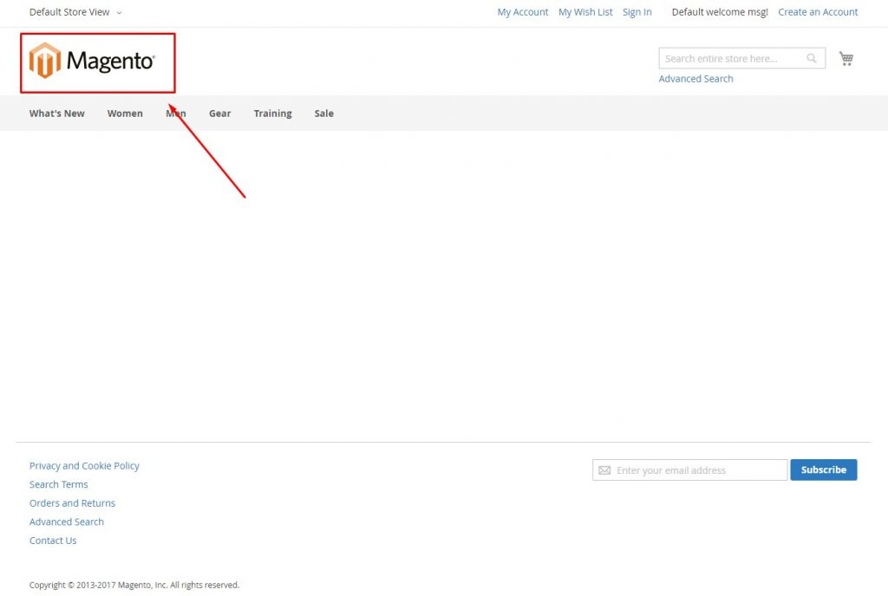
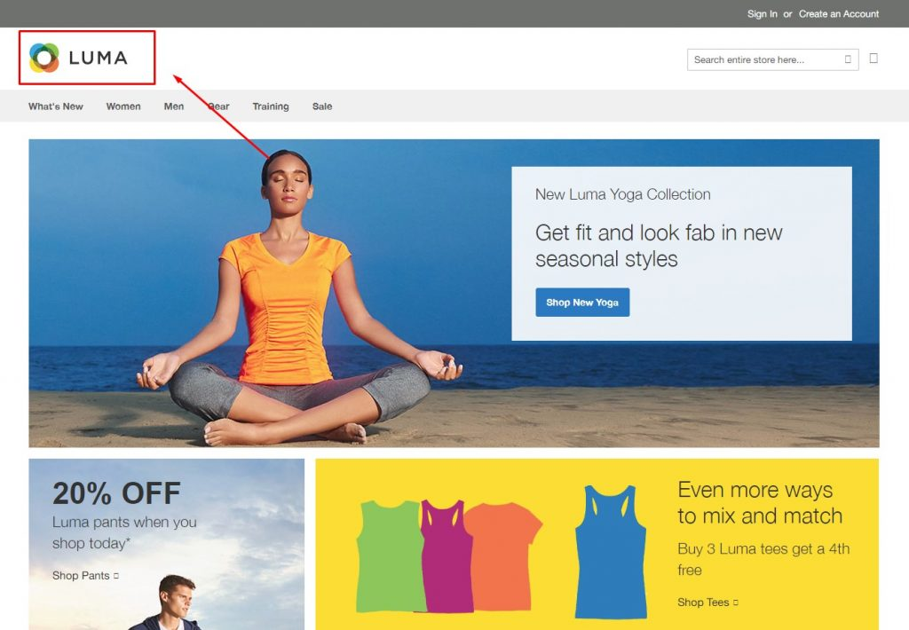
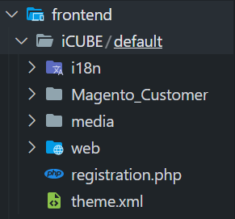
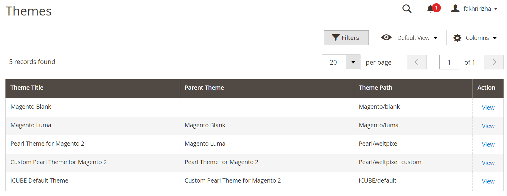
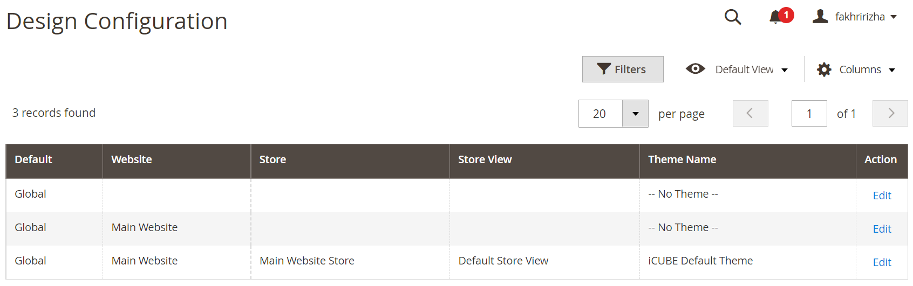
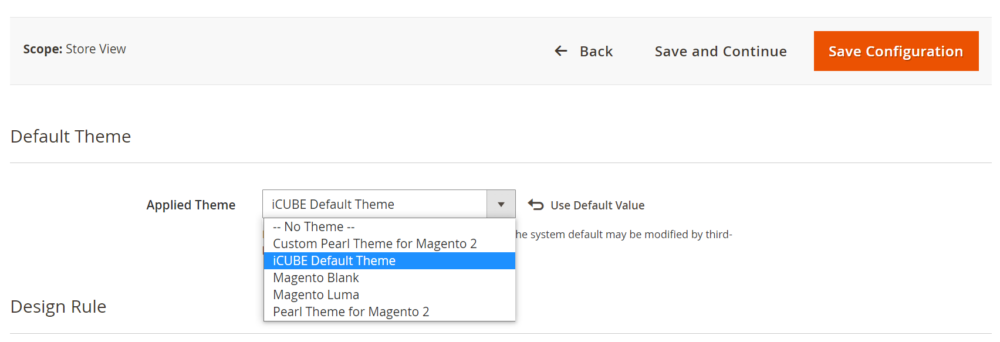
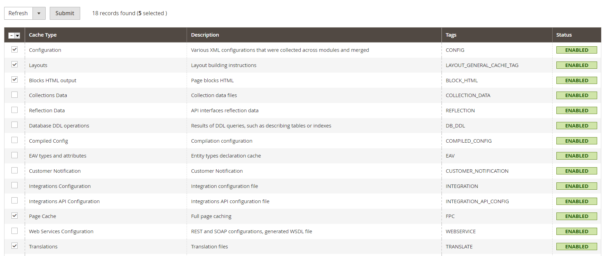
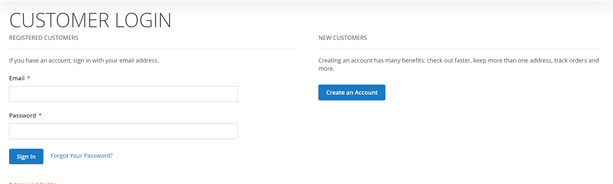
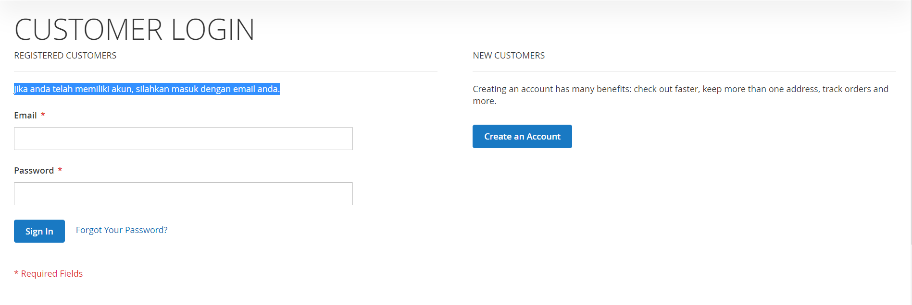

# iCUBE Training Batch 14 - Frontend

**Table of Contents**
- [iCUBE Training Batch 14 - Frontend](#icube-training-batch-14---frontend)
- [Tema](#tema)
    - [Blank Theme](#blank-theme)
    - [Luma Theme](#luma-theme)
- [Jenis Tema](#jenis-tema)
    - [Standalone](#standalone)
    - [Inheritance](#inheritance)
- [Struktur Folder Tema](#struktur-folder-tema)
  - [Struktur Folder Tema](#struktur-folder-tema-1)
    - [Komponen Tema](#komponen-tema)
    - [Komponen Modul Tema](#komponen-modul-tema)
    - [Komponen Modul Web Tema](#komponen-modul-web-tema)
    - [Komponen Modul Layout Tema](#komponen-modul-layout-tema)
    - [Komponen Modul Template Tema](#komponen-modul-template-tema)
    - [Komponen i18n](#komponen-i18n)
    - [Komponen media](#komponen-media)
    - [Komponen web](#komponen-web)
    - [composer.json](#composerjson)
    - [registration.php](#registrationphp)
    - [theme.xml](#themexml)
- [How-to-basic](#how-to-basic)
  - [Cara register _custom-theme_ pada Magento](#cara-register-custom-theme-pada-magento)
  - [Cara melakukan terjemahan pada _custom-theme_](#cara-melakukan-terjemahan-pada-custom-theme)
  - [Cara aktivasi templatehints pada Magento](#cara-aktivasi-templatehints-pada-magento)
  - [Cara meng-_extend_ atau memodifikasi layout pada tema](#cara-meng-extend-atau-memodifikasi-layout-pada-tema)

# Tema

Secara default, tema yang tersedia pada Swift-Magento ada 2 macam :
* Blank Theme
* Luma Theme

### Blank Theme

<p align="center">
 
</p>

### Luma Theme

<p align="center">
 
</p>

> **Note!** Pada umumnya, tema default yang dipakai oleh Swift adalah Luma.

# Jenis Tema

Berdasarkan _dependency_, jenis tema pada Swift-Magento dibagi menjadi 2 macam :

### Standalone

Tema standalone, atau bissa disebut tema parent, pada hakikatnya merupakan tema **parent** yang berfungsi sebagai dasar dari _custom-theme_ yang akan dibuat.

### Inheritance

Tema inheritance, atau bisa disebut tema turunan, merupakan tema yang telah dikustomisasi dan mengacu pada tema standalone atau tema parent tertentu.

# Struktur Folder Tema

Dalam membuat sebuah tema, kita harus menggunakan standar struktur folder yang telah ditetapkan oleh Magento. Tema yang akan dibuat diletak pada ( `app\design\frontend` ). Berikut adalah struktur folder tema pada Magento.

## Struktur Folder Tema
```
Secara singkat :

<nama-direktori-swift>
┗ app
  ┗ design
    ┗ frontend
      ┗ <nama-vendor-a>
        ┣ <nama-tema-1>
        ┗ <nama-tema-2>
      ┗ <nama-vendor-b>
        ┣ <nama-tema-1>
        ┗ <nama-tema-2>

Secara lengkap :

<nama-direktori-swift>
┗ app
  ┗ design
    ┗ frontend
      ┗ <nama-vendor>
        ┗ <nama-tema>
          ┣ <nama-modul>
          ┃ ┣ web
          ┃ ┃ ┗ css
          ┃ ┃   ┗ source
          ┃ ┣ layout
          ┃ ┃ ┗ override
          ┃ ┗ templates
          ┣ etc
          ┣ i18n
          ┣ media
          ┣ web
          ┃ ┣ css
          ┃ ┃ ┗ source
          ┃ ┣ fonts
          ┃ ┣ images
          ┃ ┗ js
          ┣ composer.json
          ┣ registration.php
          ┗ theme.xml
```

Kita dapat memecah struktur folder tersebut berdasarkan fungsinya

### Komponen Tema

Struktur folder tema pada Magento pada umumnya akan seperti ini.
```
<nama-tema>
┣ <nama-modul>
┃ ┣ web
┃ ┃ ┗ css
┃ ┃   ┗ source
┃ ┣ layout
┃ ┃ ┗ override
┃ ┗ templates
┣ etc
┣ i18n
┣ media
┣ web
┃ ┣ css
┃ ┃ ┗ source
┃ ┣ fonts
┃ ┣ images
┃ ┗ js
┣ composer.json
┣ registration.php
┗ theme.xml
```

### Komponen Modul Tema

Folder ini berisikan  _layout_ dan _template_ pada tema.
```
<nama-modul>
┣ web
┃ ┗ css
┃   ┗ source
┣ layout
┃ ┗ override
┗ templates
```

### Komponen Modul Web Tema

Folder ini berisikan file **.css** dan juga **.less**.
```
web
┗ css
  ┗ source
```

### Komponen Modul Layout Tema

Folder ini berisikan file _layout_ yang akan meng-_extend_ modul _default_ atau _layout_ pada _parent-theme_.
```
layout
┗ override
```

### Komponen Modul Template Tema

Folder ini berisikan file _template_ yang akan meng-_override_ modul _default-template_ atau _template_ dari _parent-theme_. File _custom-template_ juga biasanya diletakkan pada folder ini. 
```
<nama-modul>
┗ templates
```

### Komponen i18n

Folder ini berisikan file untuk mengatur terjemahan teks pada _custom-template_ yang akan kita buat.
```
<nama-modul>
┗ i18n
```

### Komponen media

Folder ini berisikan _preview_ dari tema yang kita buat (biasanya merupakan sebuah _screenshot_)
```
<nama-modul>
┗ media
```

### Komponen web

Folder ini berisikan file tema ***.less** yang akan meng-_invoke_ _mixins_ dari elemen global yang diatur oleh **Magento UI Library**, dan file **theme.less** yang akan meng-_override_ nilai variabel default.
```
web
┣ css
┃ ┗ source
┣ fonts
┣ images
┗ js
```

### composer.json

File ini berfungsi untuk mendeklarasikan _dependency_ dari tema yang kita buat dan beberapa _meta-information_. Folder ini biasanya dikelola dengan menggunakan _composer_.
```
<nama-tema>
┗ composer.json>
```

### registration.php

File ini berisikan konfigurasi pada tema untuk mendeklarasikan direktori tema untuk dapat dikenali Magento.
```
<nama-tema>
┗ registration.php
```

Contoh :
```php
<?php
    \Magento\Framework\Component\ComponentRegistrar::register(
        \Magento\Framework\Component\ComponentRegistrar::THEME,
        'frontend/iCUBE/default',
        __DIR__
    );
?>
```

### theme.xml

File ini berisikan konfigurasi dan deskripsi dasar pada tema yang nantinya akan dikenali Magento sebagai sebuah komponen sistem (untuk tema). Pada file ini biasanya juga akan diset apakah tema ini merupakan _inheritance_ dari tema lain atau tidak pada tag `<parent></parent>` dan untuk mengatur nama tema pada tag `<title></title>`.

Sebagai tambahan, pada file XML ini kita juga dapat mengatur _source_ preview tema dengan menggunakan tag `<preview_image></preview_image>`.

Contoh :
```xml
<theme xmlns:xsi="http://www.w3.org/2001/XMLSchema-instance" xsi:noNamespaceSchemaLocation="urn:magento:framework:Config/etc/theme.xsd">
   <title>iCUBE Default Theme</title>
   <parent>Pearl/weltpixel_custom</parent>
   <media>
       <preview_image>media/preview.jpg</preview_image>
   </media>
</theme>
```

# How-to-basic

## Cara register _custom-theme_ pada Magento

1. Buatlah folder dengan struktur sesuai yang ditetapkan oleh Magento pada `app\design\frontend`. Biasanya tema dimasukkan lagi ke dalam folder `default`(opsional), dan nanti akan disesuaikan pada file `registration.php`, <br>Contoh :
    <p>
        
    </p>
2. Kemudian, pada file `registration.php`, masukkan kode berikut :
    ```php
    <?php
        \Magento\Framework\Component\ComponentRegistrar::register(
            \Magento\Framework\Component\ComponentRegistrar::THEME,
            '{theme_directory}',
            __DIR__
        );
    ?>
    ```
    Keterangan
    - **`{theme_directory}`** : Lokasi direktori tema yang digunakan, contoh : `'frontend/iCUBE/default'` (tanpa tanda kurung kurawal)
3. Setelah itu, pada file `theme.xml` masukkan konfigurasi berikut ini :
    ```xml
    <theme xmlns:xsi="http://www.w3.org/2001/XMLSchema-instance" xsi:noNamespaceSchemaLocation="urn:magento:framework:Config/etc/theme.xsd">
        <title>{theme_title}</title>
        <parent>{theme_parent_name}</parent>
        <media>
            <preview_image>{theme_preview_image}</preview_image>
        </media>
    </theme>
    ```
    Keterangan
    - **`{theme_title}`** : Judul/nama tema yang digunakan, contoh : `'iCUBE Custom Theme'` (tanpa tanda kurung kurawal)
    - **`{theme_parent_name}`** : Nama _parent-theme_ yang digunakan, contoh : `'Pearl/weltpixel'` (tanpa tanda kurung kurawal)
    - **`{theme_preview_image}`** : Lokasi file dari _preview-image_ tema yang digunakan, contoh : `'media/preview.jpg'` (tanpa tanda kurung kurawal)
4. Setelah itu, lakukan full deploy aplikasi dengan perintah :
    ```bash
    php bin/magento setup:upgrade

    php bin/magento setup:di:compile

    php bin/magento weltpixel:less:generate

    php bin/magento setup:static-content:deploy -f

    php bin/magento weltpixel:css:generate --store=default

    php bin/magento cache:clean

    php bin/magento cache:flush

    chmod -R 777 var/ pub/ generated/ 
    ```
   Proses instalasi dapat memakan waktu beberapa menit tergantung pada _allocated resource_ yang diberikan pada _virtual environment_ anda, **dianjurkan** untuk meng-_allocate_ resource memory minimal 4GB. Tunggu proses hingga selesai.
   > Full deploy **wajib** dilakukan setiap menambahkan folder tema baru pada Magento.
5. Selanjutnya, silahkan buka halaman backoffice Swift-Magento anda.
6. Kemudian, klik menu **Content** pada sidebar, lalu klik **Themes**.
7. Tema yang kita daftarkan akan terlihat pada list.
    <p>
        
    </p>
8. Untuk mengaktivasi tema pada magento, klik menu **Content** pada sidebar, lalu klik **Configuration**, lalu klik **Edit**.
    <p>
        
    </p>
9. Setelah itu, pilih tema yang sudah kita daftarkan tadi (iCUBE Default Theme), lalu klik **Save Configuration**.
    <p>
        
    </p>
10. Selanjutnya, hapus cache pada Magento dengan cara klik **System** lalu **Cache Management**.
11. Ceklis seperti gambar dibawah ini (**Configuration, Layouts, Blocks HTML Output, Page Cache, Translation)** lalu klik **Submit**.
    <p>
        
    </p>
12. Tema berhasil diaktifkan.

## Cara melakukan terjemahan pada _custom-theme_

1. Buatlah file pada folder `i18n` dengan kode nama negara, misalnya jika kita ingin membuat terjemahan pada English (America), maka nama filenya menjadi `en_US.csv`.
2. Sebagai contoh, kita akan coba untuk mengubah teks "**If you have an account, sign in with your email address.**" pada menu customer login.
    <p>
        
    </p>
3. Pada file `.csv` yang sudah dibuat tadi, masukkan teks berikut :
   ```csv
   "If you have an account, sign in with your email address.","Jika anda telah memiliki akun, silahkan masuk dengan email anda."
   ```
   Quote mark sebelah kiri adalah teks yang ingin diterjemahkan, sedangkan quote mark sebelah kanan adalah terjemahan yang kita inginkan. Setelah itu, kita wajib membersihkan cache pada Magento dengan cara mengetikkan pada terminal.
    ```bash
    php bin/magento cache:clean
    ```
    > Melakukan clean cache pada magento adalah **wajib** untuk meng-_apply_ perubahan dalam terjemahan/translasi.
4. Voilà, terjemahan berhasil dilakukan (lihat tulisan yang di blok).
    <p>
        
    </p>

## Cara aktivasi templatehints pada Magento

Aktivasi templatehints sangat dianjurkan untuk dilakukan pada Magento untuk mempermudah kita mencari template layout yang ingin kita ubah. Hal ini dapat dilakukan pada menu backoffice **System->Developer->Templatehints** pada sidebar.

## Cara meng-_extend_ atau memodifikasi layout pada tema

1. Cari layout XML yang ingin kita ubah sesuai dengan tema, misalnya kita ingin melakukan perubahan pada layout customer login, maka kita dapat mencarinya di folder module-customer, yakni pada folder `vendor\magento\module-customer\view\frontend\layout\` dengan nama file `customer_account_login.xml`.
    > **Note!** Gunakan templatehints untuk mempermudah pencarian template layout yang cocok.
2. Salin isi file tersebut, lalu buatlah file dengan nama yang sama pada direktori tema kita yaitu `app\design\frontend\iCUBE\default\Magento_Customer\layout\`
    > **Note!** `Magento_Customer` adalah nama class yang digunakan oleh module-customer pada Magento.<br>Cara melihat modul adalah dengan melihat pada file `vendor\magento\{nama-modul}\registration.php`. <br>Lihat pada baris :<br> `ComponentRegistrar::register(ComponentRegistrar::MODULE, 'Magento_Customer', __DIR__);`<br> dimana 'Magento_Customer' adalah nama class yang digunakan.
3. Setelah itu, modifikasi file yang telah dibuat tadi menjadi :
    ```xml
    <page xmlns:xsi="http://www.w3.org/2001/XMLSchema-instance" layout="2columns-left" xsi:noNamespaceSchemaLocation="urn:magento:framework:View/Layout/etc/page_configuration.xsd">
        <head>
            <title>Customer Login</title>
        </head>
        <body>
            <referenceContainer name="content">
                <block class="Magento\Framework\View\Element\Template" name="custom.template" template="Magento_Customer::custom/custom.phtml" />
            </referenceContainer>

            <!-- <move element="customer.new" destination="customer.login.container" before="-" /> -->
            <move element="custom.template" destination="content" before="-" />

            <referenceBlock name="customer_form_login" remove="true" />

        </body>
    </page>
    ```
    Keterangan
    - {`2columns-left`} : Bentuk layout yang digunakan pada komponen tersebut, contoh : `2columns-left`, `2columns-right`, `1column`
    - `<move element>` : Memindahkan/mengatur susunan komponen tersebut. Mirip seperti `React.createPortal()` pada framework React.js. Identifier untuk memilih element adalah `name` dari block komponen yang dinginkan, sama halnya dengan identifier untuk memilih destination, yaitu `name` dari block komponen sebagai _pivot_.
    - `<referenceBlock>` : Digunakan untuk menghapus/memodifikasi block dengan identifier `name`
    - `<referenceContainer>` : Digunakan untuk memasukkan custom block element pada komponen tersebut. Letak dari custom block element adalah pada direktori `app\design\frontend\iCUBE\default\Magento_Customer\templates\custom\`
    > **Note!** Informasi lebih lengkap dapat diperoleh dari [Magento Frontend Developer Guide](https://devdocs.magento.com/guides/v2.4/frontend-dev-guide/bk-frontend-dev-guide.html).
4. Setelah itu, lakukan clear cache pada Magento.
   ```bash
    php bin/magento cache:clean
    ```
    > Melakukan clean cache pada magento adalah **wajib** untuk meng-_apply_ perubahan layout komponen.